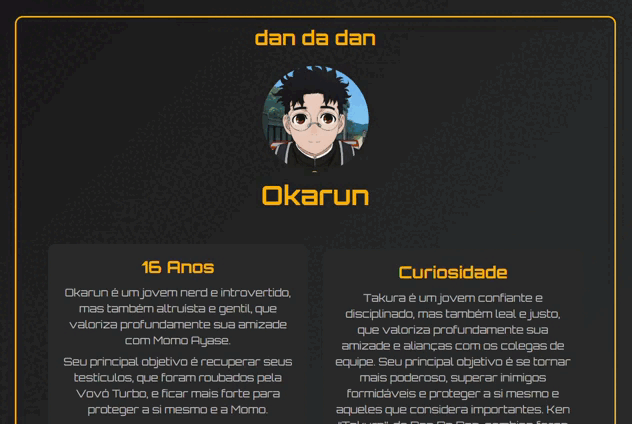

# 🎴 Dan-Da-Dan-Card


Projeto de estudos do curso **DevQuest - React Base**, com foco em praticar os fundamentos de **componentes, props e eventos** no React com TypeScript.  
O projeto foi inspirado no anime **Dan Da Dan** e utiliza um **card de personagem** como base para aplicar os desafios.

---

## 🎯 Objetivos do Projeto
- Criar um card de personagem estilizado.
- Cumprir os **desafios propostos** na Quest React Base.
- Exercitar conceitos de **componentização, props, estados e eventos**.

## 🧩 Desafios Cumpridos

### 🔹 Desafio 1  
Componente que **colore** e transforma um **texto para maiúsculo (uppercase)** utilizando **props**.

### 🔹 Desafio 2  
Mostrar uma **mensagem com a label do botão** ao clicar, utilizando `alert`.

## 🃏 Sobre o Card

O card representa um **personagem de Dan Da Dan**.  
Ele exibe **nome, imagem, curiosidades e botões interativos**.  

---

## 🛠️ Tecnologias Utilizadas

O projeto utiliza as seguintes tecnologias e ferramentas:

- **React** – biblioteca principal para construção de interfaces.
- **TypeScript** – adiciona tipagem estática e segurança ao código.
- **TailwindCSS** – framework CSS para estilização rápida e responsiva.
- **Vite** – bundler e dev server para projetos modernos.
- **Node.js** – ambiente de execução JavaScript.
- **npm / Yarn** – gerenciadores de pacotes.
- **ESLint** – ferramenta de linting para manter o código limpo e consistente.
- **Fonts personalizadas** – Orbitron (Bold, Medium, Regular) para o design do card.
- **Hooks customizados** – `UseMouseOver` para interações do card.
- **Imagens e assets** – ícone do personagem em `src/assets/`, preview em `public/images/`.
- **Auxílio de IA** – uso de ChatGPT para sugestões de organização, estrutura e melhorias do projeto.

---

## 📂 Estrutura do Projeto

```text
├── .gitignore
├── eslint.config.js
├── index.html
├── package-lock.json
├── package.json
├── README.md
├── tsconfig.app.json
├── tsconfig.json
├── tsconfig.node.json
├── vite.config.ts
├── .git/...                
├── node_modules/...        
│
├── public/
│   └── images/
│       └── preview.gif       
└── src/
    ├── App.tsx
    ├── main.tsx
    │
    ├── assets/
    │   └── okarun-icon.jpg    
    │
    ├── components/
    │   ├── BorderCard/
    │   │   └── BorderCard.tsx
    │   ├── ButtonLabel/    
    │   │   └── ButtonLabel.tsx
    │   ├── ContainerCard/
    │   │   └── ContainerCard.tsx
    │   ├── ImagemCard/
    │   │   └── ImagemCard.tsx
    │   ├── NomeCard/
    │   │   └── NomeCard.tsx
    │   ├── SobrePersonagem/
    │   │   ├── CuriosidadeCard.tsx
    │   │   ├── PersonagemComCuriosidade.tsx
    │   │   └── SobreCard.tsx
    │   └── TituloCard/     
    │       └── TituloCard.tsx
    │
    ├── data/
    │   └── okarun.ts       
    │
    ├── hooks/
    │   └── UseMouseOver.ts 
    │
    ├── logic/
    │   └── ButtonActions.ts
    │
    ├── Styles/
    │   └── globals.css     
    │
    └── types/
        └── types.ts         
```

---

## 👀 Preview

  

---

## 🙏 Agradecimentos

Quero agradecer a todos que contribuíram para o aprendizado deste projeto, ao curso **DevQuest**, à comunidade React e à biblioteca **TailwindCSS**!   

- Recursos utilizados: [React](https://reactjs.org/), [TypeScript](https://www.typescriptlang.org/), [TailwindCSS](https://tailwindcss.com/), [Vite](https://vitejs.dev/)  
- Inspiração: anime **Dan Da Dan**